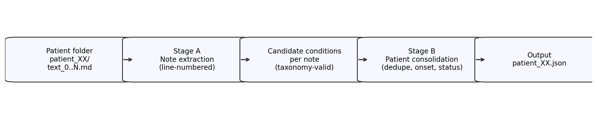

<h1 align="center">
  <a href="./#gh-light-mode-only">
    
  </a>
  <a href="./#gh-dark-mode-only">
    
  </a>
</h1>

<p align="center">
  <i align="center">Clinical condition extraction from longitudinal notes using an OpenAI-compatible LLM API.</i>
</p>

<h4 align="center">
  <a href="./LICENSE">
    
  </a>
  <a href="./requirements.txt">
    
  </a>
  <a href="./Data/taxonomy.json">
    
  </a>
  <a href="./Data/problem_statement.md">
    
  </a>
</h4>

<p align="center">
  
</p>

## Introduction

This repository contains a **production-oriented clinical NLP pipeline** for the assignment in `Data/problem_statement.md`.

Given a patient’s longitudinal clinical notes (`text_0.md … text_N.md`), the system outputs a **structured condition summary** as one JSON file per patient:

- Strict mapping to the taxonomy in `Data/taxonomy.json`
- Condition `status` as of the latest note where it appears
- Condition `onset` per the assignment’s priority rules
- Line-numbered `evidence` spans copied verbatim from the notes

## Repository layout

```
Clinical_Nlp_Extraction/   # Python package (pipeline implementation)
Data/                      # Dataset + assignment spec + taxonomy (this folder should be pushed)
report/                    # REPORT.md + Overleaf LaTeX + generated figures
main.py                    # CLI entrypoint (evaluator runs this)
requirements.txt           # Python dependencies
```

## Usage

### Install

```bash
pip install -r requirements.txt
```

### Environment variables (provided by evaluator)

The pipeline uses an **OpenAI-compatible API** and reads:

- `OPENAI_BASE_URL`
- `OPENAI_API_KEY`
- `OPENAI_MODEL`

### Run inference (real extraction)

Create a patient list JSON (example `patients.json`):

```json
["patient_02", "patient_08", "patient_15"]
```

Run:

```bash
python main.py \
  --data-dir ./Data/dev \
  --patient-list ./patients.json \
  --output-dir ./output_real \
  --cache-dir ./.cache_run \
  --temperature 0
```

Outputs:
- `output_real/patient_XX.json` (one per patient)
- `output_real/_manifest.json`

### Validate outputs

```bash
python -m Clinical_Nlp_Extraction.validate_outputs \
  --output-dir ./output_real \
  --taxonomy-path ./Data/taxonomy.json
```

## Tests / sanity checks

### Dry-run (no API calls)

Dry-run validates CLI wiring and output formatting without hitting the LLM:

```bash
python main.py \
  --data-dir ./Data/dev \
  --patient-list ./patients_dev.json \
  --output-dir ./output_dry \
  --dry-run
```

Expected:
- `output_dry/patient_XX.json` with `"conditions": []`
- No token usage (no HTTP calls)

### API run (OpenRouter example)

Set environment variables (example):

```bash
export OPENAI_BASE_URL="https://openrouter.ai/api/v1"
export OPENAI_API_KEY="***"
export OPENAI_MODEL="meta-llama/llama-3-8b-instruct"
```

Run with a fresh cache directory to ensure calls are made:

```bash
python main.py \
  --data-dir ./Data/dev \
  --patient-list ./patients_dev.json \
  --output-dir ./output_api_only \
  --cache-dir ./.cache_api_only \
  --temperature 0 \
  --verbose
```

Expected:
- HTTP `POST .../chat/completions` logs
- A non-zero token usage summary at the end (e.g., “LLM Usage: N calls | … tokens …”)

## Notes on pushing to git

The `Data/` folder **should be pushed** (it contains the assignment spec, taxonomy, and dataset).

Do **not** push:
- `output*/`, `out_*/` (generated predictions)
- `.cache*/` (LLM cache)
- `.env` (credentials)

These are ignored via `.gitignore`.
