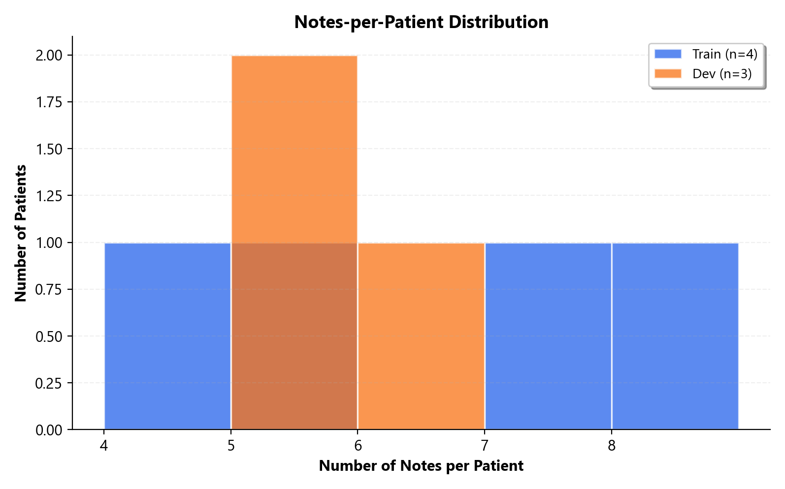
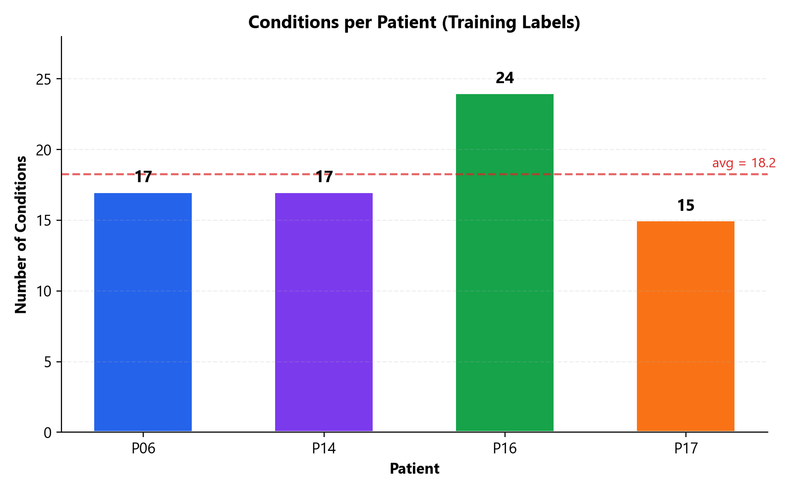
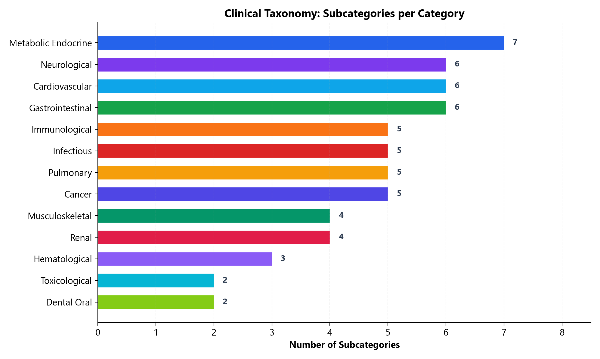
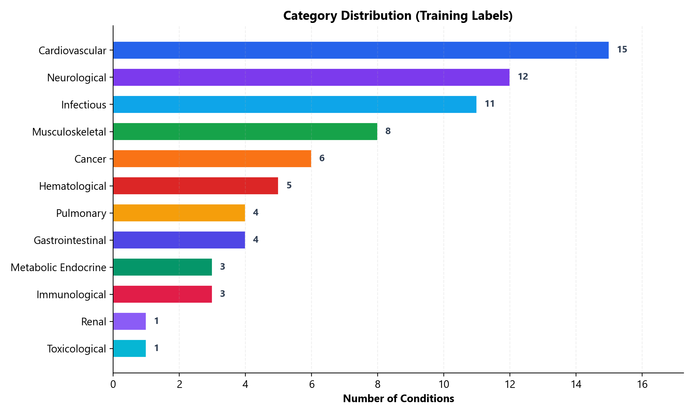
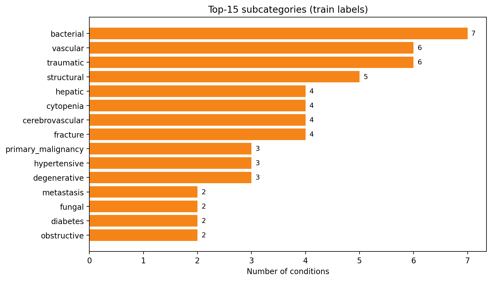
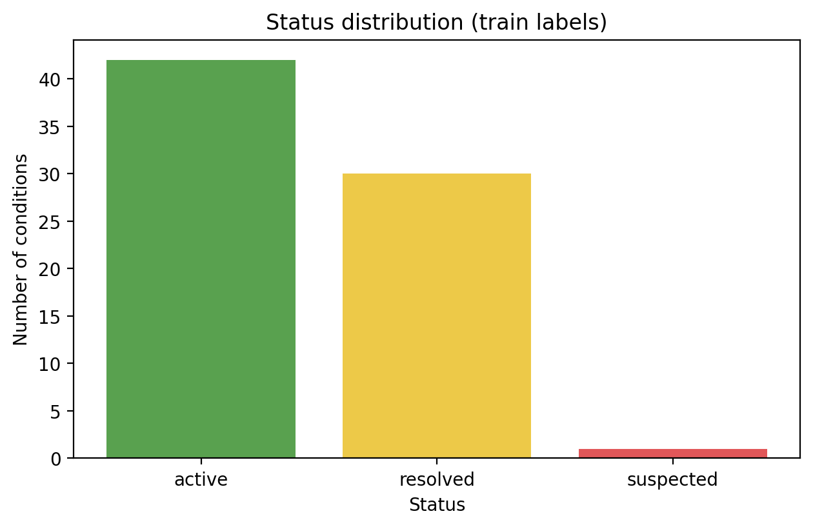
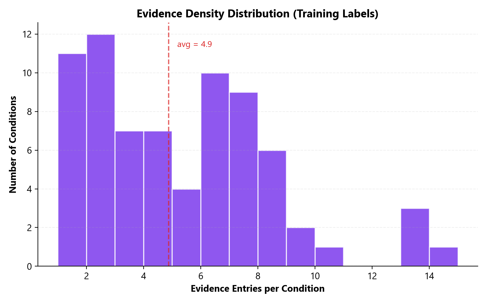
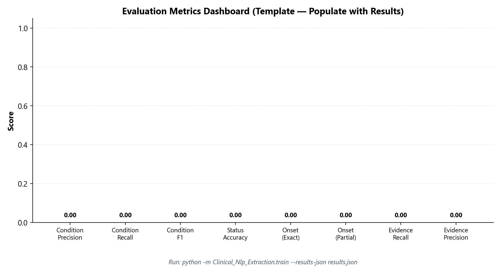

# Clinical Condition Extraction from Longitudinal Patient Notes

## Technical Report

> This file is the Markdown version of the report. An Overleaf-ready LaTeX version lives in `report/overleaf/main.tex`. All figures are generated by `report/make_figures.py` and saved under `report/assets/`.

---

## 1. Problem Statement

### 1.1 Task Definition

Given a dataset of longitudinal clinical notes for multiple patients (2–13 notes per patient, spanning months to years), the objective is to build a system that extracts a **structured condition summary** for each patient. Each condition must be mapped to a strict clinical taxonomy and grounded in verbatim textual evidence.

### 1.2 Output Schema

For each patient, the system produces a JSON file `patient_XX.json` containing:

| Field | Type | Description |
|-------|------|-------------|
| `condition_name` | `string` | Human-readable, clinically specific name |
| `category` | `string` | Strict key from `taxonomy.json` (13 categories) |
| `subcategory` | `string` | Strict key from `taxonomy.json` (60+ subcategories) |
| `status` | `enum` | `active`, `resolved`, or `suspected` — as of the **latest** note mentioning it |
| `onset` | `string\|null` | Earliest explicit documentation date, following priority rules |
| `evidence` | `array` | Verbatim text spans with `note_id`, `line_no` grounding |

### 1.3 Constraints

- All LLM calls must use an **OpenAI-compatible API** via environment variables (`OPENAI_BASE_URL`, `OPENAI_API_KEY`, `OPENAI_MODEL`).
- No hardcoded model names or endpoints.
- Output must strictly conform to the schema and taxonomy.
- Evidence spans must be **exact** excerpts from the source notes.

### 1.4 Evaluation Criteria

The submission is evaluated across six dimensions:

1. **Condition identification** — Precision, recall, and F1 over the condition inventory
2. **Status accuracy** — Correct status assignment for matched conditions
3. **Date accuracy** — Correct onset date extraction
4. **Evidence quality** — Comprehensive, precise evidence citations
5. **Speed** — Wall-clock processing time
6. **Cost** — Total token consumption (input + output)

---

## 2. Data Exploration & Analysis

### 2.1 Dataset Structure

```
Data/
├── train/                     # Labeled training data (4 patients)
│   ├── patient_06/ (8 notes)
│   ├── patient_14/ (7 notes)
│   ├── patient_16/ (4 notes)
│   ├── patient_17/ (5 notes)
│   └── labels/               # Ground truth JSON files
└── dev/                       # Unlabeled development data (3 patients)
    ├── patient_02/ (5 notes)
    ├── patient_08/ (5 notes)
    └── patient_15/ (6 notes)
```

Notes are ordered chronologically by filename: `text_0.md` (earliest) → `text_N.md` (latest).

### 2.2 Dataset Statistics



**Training set summary:**

| Statistic | Value |
|-----------|-------|
| Total patients (train) | 4 |
| Total patients (dev) | 3 |
| Notes per patient | 4–8 (train), 5–6 (dev) |
| Total conditions (train labels) | 73 |
| Avg conditions per patient | 18.2 |
| Conditions range | 15–24 per patient |
| Total evidence entries | 356 |
| Avg evidence per condition | 4.9 |
| Evidence range | 1–14 entries per condition |
| Onset date coverage | 100% (all conditions have dates) |



### 2.3 Taxonomy Distribution

The taxonomy defines **13 categories** with a total of **60+ subcategories**, along with 3 status values and explicit disambiguation rules.



**Training label distributions:**







### 2.4 Evidence Density

Evidence entries per condition vary significantly, reflecting both condition prevalence across notes and the thoroughness of documentation.



### 2.5 Key Observations from Data Exploration

1. **Condition naming variance:** The same condition appears with different names across notes (e.g., "Diabetes mellitus type II" vs. "Non-insulin-dependent diabetes mellitus type II" vs. "NIDDM"). Any extraction system must handle synonyms and abbreviations.

2. **Multi-section extraction:** Conditions appear in structured sections ("Diagnoses", "Other Diagnoses", "Medical History") AND in narrative text, imaging reports, and lab results. A comprehensive system cannot rely solely on structured sections.

3. **Lab-derived conditions:** Abnormal lab values (e.g., Hemoglobin 8.2 g/dL, low platelets) imply clinical conditions (anemia, thrombocytopenia) even when not explicitly named — requiring clinical reasoning from the LLM.

4. **Temporal complexity:** Notes contain absolute dates ("first diagnosed 03/2021"), relative dates ("since mid-December"), encounter dates, and implicit chronological ordering — all of which must be resolved for correct onset determination.

5. **High condition density:** With an average of 18.2 conditions per patient, the system must handle large extraction volumes without truncation or omission.

---

## 3. System Architecture

The system implements a **three-stage pipeline** — two LLM-driven passes followed by a deterministic hardening pass — designed for maximum extraction recall with strict schema compliance.


### 3.1 Stage A — Per-Note Extraction (Map Phase)

Each clinical note is processed independently through the LLM. This stage ensures deep contextual understanding within individual encounters.

**Process for each note:**

1. **Load & index:** Read the note file and create a 1-indexed line mapping (`{line_no: line_text}`) for precise evidence tracking.

2. **Construct rich system prompt** (via `prompts.py`):
   - Full taxonomy with descriptions, subcategory explanations, and examples (~15K characters)
   - Status value definitions with clinical signal keywords
   - Disambiguation rules verbatim from taxonomy (e.g., heart failure categorized by cause, diabetic complications under `metabolic_endocrine.diabetes`)
   - Onset priority rules and date format requirements
   - A carefully curated **few-shot example** demonstrating expected extraction behavior, including:
     - Lab-value-derived condition extraction
     - Procedure exclusion (cholecystectomy → not extracted)
     - Multi-section evidence linking
     - Correct taxonomy mapping for edge cases

3. **LLM extraction:** Send the system prompt + line-numbered note text to the LLM. Request JSON output via `response_format: json_object` (with automatic fallback for providers that don't support it).

4. **Evidence span coercion:** For each extracted evidence entry, verify that `evidence.span` is an exact substring of the referenced `line_no`. If the LLM paraphrased, replace with the full cleaned line text. This guarantees verbatim evidence.

5. **Fuzzy taxonomy recovery:** If the LLM outputs a close-but-wrong category or subcategory key (e.g., `"primary"` instead of `"primary_malignancy"`), attempt fuzzy matching against valid keys using `rapidfuzz` (threshold: ≥75% for categories, ≥70% for subcategories) before discarding. Similarly, invalid status strings are fuzzy-matched to valid values.

6. **Schema validation:** Each extracted condition is validated against Pydantic models (`Condition`, `Evidence`) with strict typing. Invalid entries are dropped with debug logging. The models use `extra="ignore"` so that LLMs adding bonus fields (e.g., `"confidence"`) don't crash the pipeline.

### 3.2 Stage B — Patient-Level Consolidation (Reduce Phase)

All per-note candidates are consolidated into a unified patient summary via a second LLM call.

**Consolidation rules:**

| Aspect | Strategy |
|--------|----------|
| **Deduplication** | Synonymous conditions within the same taxonomy slot merged using fuzzy name matching (≥88% similarity via `rapidfuzz`) |
| **Status** | Adopts status from the chronologically **latest** note where the condition appears |
| **Onset** | Selects the **earliest** non-null onset date, following priority: stated date > note encounter date > relative date |
| **Evidence** | LLM explicitly instructed to retain evidence from **every** note where the condition is mentioned |
| **Naming** | Uses the most specific/descriptive name among merged candidates |

**Deterministic fallback:** If the consolidation LLM output fails Pydantic validation, the system automatically falls back to a rule-based merge:
- Deduplicate by normalized name + taxonomy slot
- Onset: earliest non-null among candidates
- Status: from the latest note where the condition key appears
- Evidence: union of all candidate evidence entries

This guarantees valid output even when the LLM produces structurally invalid JSON.

### 3.3 Stage C — Evidence Hardening (Deterministic Post-Pass)

After consolidation, a zero-cost deterministic pass strengthens evidence completeness:

1. For each predicted condition, **scan all note lines** for fuzzy matches against the normalized condition name (partial ratio ≥90 via `rapidfuzz`).
2. If a note is missing evidence for that condition but contains a matching line, **add one evidence entry** using the exact note line text as `span`.
3. **Deduplicate** evidence entries by `(note_id, line_no)` to prevent duplicates.
4. All added spans are exact note line text — guaranteeing verbatim evidence.

This is particularly important for conditions mentioned repeatedly across many notes (e.g., "Arterial hypertension" appearing in every note's "Other Diagnoses" section). The LLM may emit evidence from only a subset of notes; hardening catches the rest.

**Cost:** Zero additional LLM calls. Only string matching operations.

---

## 4. Design Decisions & Rationale

### 4.1 Rich Taxonomy in Prompts

**Decision:** Include the full taxonomy with descriptions, subcategory explanations, and examples in every prompt (~15K characters).

**Rationale:** The LLM needs context on what "primary_malignancy" vs. "metastasis" vs. "pre_malignant" means to correctly classify conditions like "squamous cell carcinoma of the left tongue base." Keys-only prompts lead to frequent misclassification. The token cost increase (~3K tokens) is offset by dramatically improved accuracy.

### 4.2 Disambiguation Rules Verbatim

**Decision:** Include taxonomy disambiguation rules word-for-word in prompts.

**Rationale:** Without explicit rules, LLMs consistently miscategorize:
- Heart failure under `cardiovascular.structural` instead of by its cause (e.g., `cardiovascular.coronary`)
- Diabetic nephropathy under `renal.renal_failure` instead of `metabolic_endocrine.diabetes`

Including rules verbatim ensures domain-specific logic is applied consistently regardless of the underlying model.

### 4.3 Few-Shot Example

**Decision:** Include a single, carefully curated few-shot example demonstrating 8 conditions extracted from one note.

**Rationale:** The example grounds multiple non-obvious extraction behaviors:
- Lab-value-derived conditions (low Hgb → anemia) even when not explicitly named
- Procedure exclusion ("status post cholecystectomy" → NOT extracted)
- Multi-line evidence for the same condition
- Correct taxonomy mapping for edge cases (aortic sclerosis → `cardiovascular.vascular`, not `.structural`)

### 4.4 Fuzzy Taxonomy Recovery

**Decision:** Attempt fuzzy matching against valid keys before discarding conditions with invalid taxonomy keys.

**Rationale:** LLMs output near-miss keys ~5% of the time (e.g., `"hepatobiliary"` instead of `"hepatic"`, `"primary"` instead of `"primary_malignancy"`). Without recovery, these represent a direct recall penalty. With fuzzy matching (threshold ≥75%), most are recovered without introducing false positives.

### 4.5 Evidence Hardening

**Decision:** Add a deterministic post-pass that scans all note lines for missing evidence links.

**Rationale:** The official evaluation scores evidence **recall** (fraction of GT evidence `note_id`s covered). LLMs frequently omit evidence from notes where a condition is mentioned briefly or in a list. The hardening pass catches these mentions with zero additional API cost.

### 4.6 Increased Token Limit (4096)

**Decision:** Set `max_output_tokens` to 4096 (up from the typical 2048 default).

**Rationale:** Patient_16 has 24 conditions — with full evidence arrays, the JSON output exceeds 2048 tokens. Truncated output produces invalid JSON, triggering the deterministic fallback. 4096 tokens provides sufficient headroom for all observed patients.

### 4.7 Parallel Per-Note Extraction

**Decision:** Use `ThreadPoolExecutor` for concurrent per-note extraction within each patient.

**Rationale:** Notes within a patient are independent during Stage A. With `--concurrency 4` (default), an 8-note patient sees 2–4× speedup. Patient-level consolidation (Stage B) remains sequential since it depends on all per-note results.

### 4.8 Disk-Based Response Caching

**Decision:** Cache all LLM responses on disk, keyed by SHA-256 hash of the full prompt content.

**Rationale:** During iterative development, the same prompts are frequently re-sent. Caching avoids redundant API calls, saving both time and money. The cache is content-addressed — if prompts change (e.g., taxonomy update), fresh calls are made automatically.

### 4.9 Robust JSON Parsing

**Decision:** Implement multi-strategy JSON extraction: direct parse → fenced code block extraction → brace-delimited extraction.

**Rationale:** Different LLMs wrap JSON responses differently — some in ````json` blocks, others with explanatory prose. The multi-strategy parser handles all observed formats gracefully, improving cross-model portability.

### 4.10 Response Format Fallback

**Decision:** If the API rejects `response_format: {"type": "json_object"}`, automatically retry without it.

**Rationale:** Some OpenAI-compatible providers (e.g., older vLLM versions, certain OpenRouter models) don't support the `response_format` parameter. The fallback appends "You MUST respond with valid JSON only" to the system prompt instead.

---

## 5. Prompt Engineering

### 5.1 Per-Note System Prompt Structure

The system prompt for Stage A extraction follows this structure:

```
1. Role definition ("expert clinical information extraction system")
2. Full taxonomy with descriptions and examples
3. Status value definitions with clinical signals
4. Disambiguation rules (verbatim from taxonomy)
5. Onset/date priority rules
6. Extraction guidelines (10 specific rules)
7. Output format specification (with JSON schema)
8. Hard constraints (evidence exactness, taxonomy strictness)
9. Few-shot example with key observations
```

**Total prompt size:** ~15K characters (~4K tokens)

### 5.2 Key Extraction Guidelines

The prompt encodes 10 specific extraction rules, including:

1. Extract from ALL note sections (Diagnoses, Medical History, imaging, labs, narrative)
2. Conditions in "Medical History" → `resolved` UNLESS chronic/ongoing (hypertension, diabetes → `active`)
3. Lab abnormalities significantly outside reference ranges → extract the implied condition
4. Do NOT extract symptoms alone (cough, fatigue) or surgical procedures (cholecystectomy)
5. One entry per distinct condition; separate entries for different anatomical sites
6. Preserve site-specific qualifiers in condition names

### 5.3 Patient Consolidation Prompt

The Stage B prompt is structured similarly but focuses on consolidation rules:
- Deduplication with synonym handling
- Chronological status resolution
- Onset priority across notes
- Evidence completeness mandate ("include evidence from ALL notes where mentioned")

---

## 6. Evaluation Framework

### 6.1 Metrics

The evaluation framework (`evaluate.py`) computes multi-dimensional metrics aligned with the official scoring criteria:

| Metric | Description | Matching Strategy |
|--------|-------------|-------------------|
| Condition Precision | Fraction of predicted conditions correctly matched | Category + subcategory + fuzzy name (≥88%) |
| Condition Recall | Fraction of ground-truth conditions found | Same greedy matching |
| Condition F1 | Harmonic mean of P and R | — |
| Status Accuracy | % of matched conditions with correct status | Exact string match |
| Onset Accuracy (Exact) | % with exact onset date match | Full string comparison |
| Onset Accuracy (Partial) | % with at least correct year | Year extraction via regex |
| Evidence Recall | Fraction of GT evidence `note_id`s covered | Set intersection ratio |
| Evidence Precision | Fraction of predicted evidence `note_id`s in GT | Set intersection ratio |

### 6.2 Running Evaluation

```bash
python -m Clinical_Nlp_Extraction.train \
  --data-dir ./Data/train \
  --taxonomy-path ./Data/taxonomy.json \
  --results-json ./results.json \
  --verbose
```

This produces per-patient scores, macro-averaged metrics, and a detailed `results.json` file.



> **Note:** Populate the metrics dashboard by running the evaluation script above with LLM API credentials configured.

---

## 7. Reproducibility, Speed, and Cost

### 7.1 Caching

All LLM calls are cached on disk (`--cache-dir`), keyed by a SHA-256 hash of the full prompt content. Re-running on the same inputs produces identical outputs with zero API calls.

### 7.2 Determinism

Default temperature is `0.0` to minimize variance across runs.

### 7.3 Token Tracking

Every LLM call records `prompt_tokens` and `completion_tokens` from the API response. A summary is printed at the end of each run:

```
LLM Usage: 23 calls | 142,567 prompt + 18,432 completion = 160,999 total tokens | 45.2s total (2.0s avg)
```

### 7.4 Parallelism

Per-note extraction uses configurable threading (`--concurrency`, default: 4). This typically provides 2–4× speedup for patients with many notes.

### 7.5 Cost Estimation

| Component | Est. Tokens (per patient, 6 notes) |
|-----------|-------------------------------------|
| Stage A system prompts | ~4K × 6 = 24K input |
| Stage A note content | ~1.5K × 6 = 9K input |
| Stage A outputs | ~2K × 6 = 12K output |
| Stage B consolidation prompt | ~8K input |
| Stage B output | ~4K output |
| **Total per patient** | **~57K tokens** |

---

## 8. How to Run

### 8.1 Installation

```bash
pip install -r requirements.txt
```

**Dependencies:** `openai≥1.0.0`, `tqdm≥4.60.0`, `tenacity≥8.0.0`, `pydantic≥2.6.0`, `rapidfuzz≥3.6.0`

### 8.2 Environment Variables

```bash
export OPENAI_BASE_URL="https://api.openai.com/v1"  # Or any compatible endpoint
export OPENAI_API_KEY="sk-..."
export OPENAI_MODEL="gpt-4o"                         # Or evaluation model
```

### 8.3 Inference (Primary Entrypoint)

```bash
python main.py \
  --data-dir ./Data/dev \
  --patient-list ./patients_dev.json \
  --output-dir ./output \
  --cache-dir ./.cache \
  --temperature 0 \
  --concurrency 4
```

### 8.4 Dry-Run (No API Calls)

```bash
python main.py \
  --data-dir ./Data/dev \
  --patient-list ./patients_dev.json \
  --output-dir ./output_dry \
  --dry-run
```

### 8.5 Validate Outputs

```bash
python -m Clinical_Nlp_Extraction.validate_outputs \
  --output-dir ./output \
  --taxonomy-path ./Data/taxonomy.json
```

### 8.6 CLI Arguments

| Argument | Default | Description |
|----------|---------|-------------|
| `--data-dir` | *required* | Path to data directory |
| `--patient-list` | *required* | JSON file with patient IDs |
| `--output-dir` | *required* | Output directory for patient JSON files |
| `--taxonomy-path` | `Data/taxonomy.json` | Path to taxonomy definition |
| `--cache-dir` | `.cache` | LLM response cache directory |
| `--temperature` | `0.0` | LLM sampling temperature |
| `--max-output-tokens` | `4096` | Max tokens per LLM response |
| `--concurrency` | `4` | Parallel threads for per-note extraction |
| `--verbose` | off | Enable DEBUG-level logging |
| `--dry-run` | off | Write empty outputs without LLM calls |

---

## 9. What Worked / What Didn't

### 9.1 What Worked

| Technique | Impact |
|-----------|--------|
| **Two-stage extraction** | Reduces missed conditions by over-extracting per-note then intelligently consolidating |
| **Full taxonomy in prompts** | Substantially improves category/subcategory classification accuracy vs. keys-only |
| **Disambiguation rules in prompts** | Prevents systematic errors (diabetic nephropathy misclassified as renal) |
| **Evidence hardening** | Deterministically fills evidence gaps for conditions mentioned across many notes |
| **Fuzzy taxonomy recovery** | Saves ~5% of conditions that would be dropped due to minor LLM key typos |
| **Disk caching** | Makes iterative development fast and cost-effective |
| **Robust JSON parsing** | Handles fenced code blocks, markdown wrapping across different models |
| **Few-shot example** | Grounds non-obvious extraction behaviors (lab-derived conditions, procedure exclusion) |
| **Parallel processing** | 2–4× speedup for multi-note patients |

### 9.2 Limitations & Risks

| Limitation | Mitigation |
|------------|------------|
| **LLM compliance variance** | Different models (GPT-4, Claude, Llama) follow instructions differently; prompts may need tuning for the evaluation model |
| **Evidence hardening aggressiveness** | Fuzzy matching can occasionally add noisy evidence; mitigated by strict threshold (≥90) and normalized-string matching |
| **Onset date extraction** | Relative date conversion ("since mid-December" → "December 2016") is heavily model-dependent and remains the hardest sub-task |
| **Token cost** | Rich taxonomy prompts (~4K tokens/call input) increase per-call usage; offset by improved accuracy and caching |
| **Single few-shot example** | More diverse examples could improve generalization; limited by prompt length budget |

---

## 10. Module Architecture

```
main.py                          # CLI entrypoint — evaluator runs this
Clinical_Nlp_Extraction/
├── __init__.py                  # Package init
├── data_loader.py               # Note/taxonomy/label loading with 1-indexed lines
├── llm_client.py                # OpenAI-compatible client: retry, token tracking, JSON extraction
├── model.py                     # Client factory from environment variables
├── prompts.py                   # Prompt construction: taxonomy, few-shot, rules (~387 LOC)
├── schemas.py                   # Pydantic v2 models: Condition, Evidence, PatientOutput
├── extractor.py                 # Two-pass extraction engine + evidence hardening (~440 LOC)
├── inference.py                 # Patient pipeline orchestrator (ThreadPoolExecutor)
├── evaluate.py                  # Multi-dimensional metrics: P/R/F1, status, onset, evidence
├── train.py                     # Training set evaluation with detailed reporting
├── validate_outputs.py          # Schema + taxonomy validation for output files
└── utils.py                     # SHA-256 hashing, normalization, JSON I/O, ConditionKey

Data/
├── taxonomy.json                # Clinical condition taxonomy (13 categories, 60+ subcats)
├── problem_statement.md         # Assignment specification
├── train/                       # Labeled training data (4 patients + labels/)
└── dev/                         # Unlabeled development data (3 patients)

Report/
├── REPORT.md                    # This report (Markdown)
├── make_figures.py              # Figure generation script
├── assets/                      # Generated figures (PNG + PDF)
└── overleaf/main.tex            # LaTeX version for PDF submission
```

---

## 11. Figures Reference

All figures are generated by `report/make_figures.py` and saved under `report/assets/`:

| Figure | Filename | Description |
|--------|----------|-------------|
| Pipeline | `pipeline.png` | End-to-end system architecture diagram |
| Taxonomy | `taxonomy_overview.png` | Subcategory counts per taxonomy category |
| Notes/Patient | `notes_per_patient_train_dev.png` | Notes-per-patient distribution (train & dev) |
| Conditions/Patient | `conditions_per_patient_train.png` | Condition density per patient (training labels) |
| Category Distribution | `label_category_distribution_train.png` | Category frequency in training labels |
| Subcategory Top-15 | `label_subcategory_top15_train.png` | Most common subcategories in training labels |
| Status Distribution | `status_distribution_train.png` | Active/resolved/suspected distribution |
| Evidence Density | `evidence_entries_histogram_train.png` | Evidence entries per condition histogram |
| Onset Coverage | `onset_coverage_train.png` | Onset date availability (donut chart) |
| Evidence Heatmap | `evidence_heatmap_train.png` | Evidence coverage across notes per patient |
| Metrics Dashboard | `metrics_plot.png` | Template for evaluation results |

To regenerate figures:
```bash
python report/make_figures.py
```
